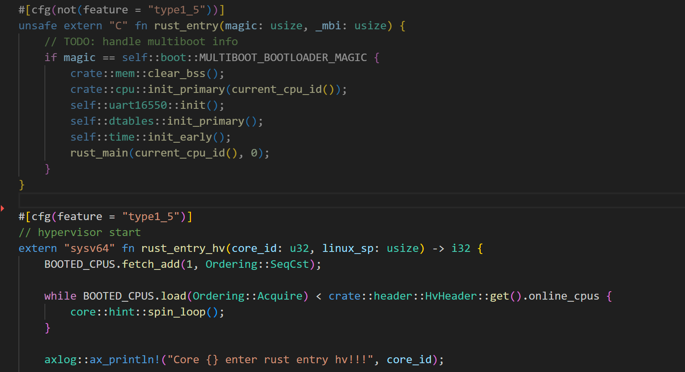
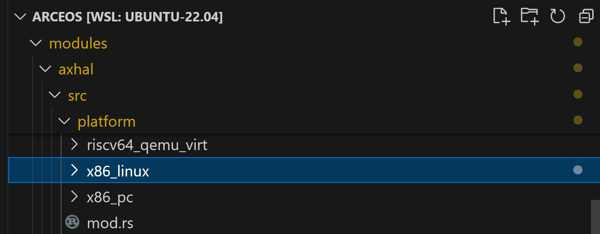
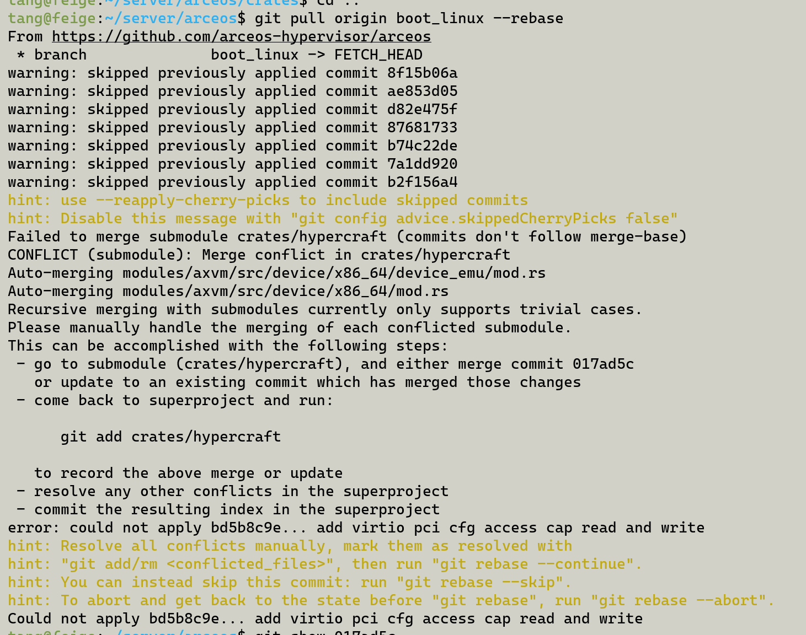

# Stage Summary for ArceOS-Hypervisor
2024/5/26

---
<!-- 总结一下这段时间在拆分/开发独立内核组件，并形成内核的过程中碰到的问题、挑战、思考、成果、建议，计划等 -->

## Problems & Challenges

* axhal imports a new (half-new) platform
* hypervisor inside ArceOS or hypervisor as a App
* git submodule
* Resource & Management
* Error Handling & Transmission

---

### axhal imports a new (half-new) platform

* Different Entry
    * ArceOS: Boot from bare-metal hardware
    * ArceOS-HV(Type1.5): Boot from Linux

---

* How to achieve
    * `modules/axhal/src/platform/pc_x86`
    1. features
        * ugly code style
        

---

* How to achieve
    * `modules/axhal/src/platform/pc_x86`
    1. features
    2. A different platform
        * redundant codes
        

---

### hypervisor inside ArceOS or hypervisor as an App

* Fundamental Problem: Extending Unikernel to Hypervisor

* Current state: Ugly mixed architecture

---
### hypervisor inside ArceOS or hypervisor as an App
* Current state: Ugly mixed architecture

* Current boot process of ArceOS-HV
1. `_start` & `switch_stack` (modules/axhal/src/platform/pc_x86/boot_type15.rs)
2. `rust_entry_hv` (modules/axhal/src/platform/pc_x86/mod.rs)
3. `rust_main` (modules/axruntime/src/lib.rs)
4. `main` (apps/hv/src/main.rs)
5. `config_boot_linux` (modules/axvm/src/vm.rs)
    1. `vm.run_type15_vcpu(hart_id, &linux_context)`

---
### hypervisor inside ArceOS or hypervisor as an App
* Current state: Ugly mixed architecture
* Current boot process of ArceOS-HV
* Problem
    * Each core construct its own independent VM structure.
    * No way to support multiple vCPU on a phycial core and perform scheduling.
    * Lack of flexibility.

---
### hypervisor inside ArceOS or hypervisor as an App
* Expected Startup Procedure

    1. axhal
    2. axruntime
    3. `main` in `apps/hv`
    4. Keep all hypervisor functionalities within the app

---
### git submodule


```toml
[submodule "crates/hypercraft"]
	path = crates/hypercraft
	url = git@github.com:arceos-hypervisor/hypercraft.git
```

* No apparent obstacles during development.
* Obstacle exists in version control.

---

* Obstacle exists in version control

    > The parent repository stores the commit hash of each submodule, not the code of the submodule itself
    * push code

        * commit submodule (hypercraft)
        * commit parent repository (arceos)
    * merge & rebase code

---
* Obstacle exists in version control


---
* Obstacle exists in version control
    * push code
    * merge&rebase code
        * merge submodule(hypercraft itself)
        * merge&rebase arceos
            * conflict in submodule
           

                ```bash
                git add crates/hypercraft
                git rebase --continue
                ```
---


### Resource & Management

Root Case: ArceOS-HV was based an independent project, [hypercraft](https://github.com/KuangjuX/hypercraft). 

---
### Resource & Management

Root Case: ArceOS-HV was based an independent project, [hypercraft](https://github.com/KuangjuX/hypercraft). 

* Expected architecture:
    * hypercraft: architectural-related virtualization functionality
    * ArceOS-HV: construct a hypervisor utilizing the foundational functionalities exposed by hypercraft.
* Overall speaking:
    * vCPU implemented by hypercraft
    * VM implemented by ArceOS-HV

---
### Resource & Management

Root Case: ArceOS-HV was based an independent project, [hypercraft](https://github.com/KuangjuX/hypercraft). 

* Chaos architecture:
    * Guest VM resources like `GuestPhysMemorySet` and `GuestPageTable` were are by `axvm` module.
    * vcpu and vm structure are exposed by hypercraft, maneged by `axvm`.
    * `vm.run_vcpu()` is called inside `axvm` module, `run_vcpu` method is exposed by hypercraft's VM structure.
    * `apps/hv` does nothing but called `config_boot_linux` inside `axvm` module.

---
### Resource & Management

* Chaos architecture

* Problem:
    * Catastrophic resource management logic.
    * No way to operate VM resource inside hypercraft.
    * Each modification requires to change codes from both ArceOS-HV and hypercraft.
* Example 
    * The implementation of [instruction decoding](https://github.com/arceos-hypervisor/hypercraft/blob/boot_linux/src/arch/x86_64/mod.rs#L256)
---
### Resource & Management

* Good architecture:
    * `PerCpuDevices` and `PerVMDevices` are exposed by hypercraft as `Trait`, implemented inside `axvm`.
        * decoupling emulated device implementation from hypercraft.
        * Allowing ArceOS-HV's customization of emulated device.

---

### Resource & Management
#### Core Problem
* How to decouple the implementation of virtualization architecture-related functionalities from resource management and runtime flow control ？

---

### Error Handling & Transmission

* error types
    * axerrno: `AxError` and `AxResult`
    * hypercraft: `HyperError`

* The combination of the use of these error types seems akward.
* Loss where exactly did this error happen during bottom-up error propagation.


* @[Su Mingxian](https://github.com/BenjaminPMLovegood) suggests we can use [anyhow](https://docs.rs/anyhow/latest/anyhow/) crate for error handling.

---

## Stage Summary

* Boot from Linux with the help of [Jailhouse kernel module](https://github.com/arceos-hypervisor/jailhouse-arceos).
* Boot [NimbOS](https://github.com/equation314/nimbos) and [ArceOS](https://github.com/rcore-os/arceos) as guest VM.
* Boot secondary Linux (slightly [modified kernel](https://github.com/arceos-hypervisor/linux-5.10.35-rt/tree/tracing)) with ramdisk file system as guest VM.
* Boot on QEMU and real x86 hardwares.
*  Some [docs](https://github.com/arceos-hypervisor/arceos-hypervisor-docs) 

---

## To be implemented

* Refactor (**modularity**)
* Migrating to ARM and RISC-V (**modularity**)
* More emulated device (**modularity**)
    * virtual local APIC for supporting multiple vCPU on the same pCPU
    * virtio devices for more functional guest VM
* **Intel VTD** for irq remapping and device memory remapping
* The compatibility with vanilla Linux

